# AsistenciaEficell — Esquema y Mapa de la App Android (Agente)

## Visión General

App Android para el **equipo de Eficell** que permite atender en tiempo real a usuarios que se conectan desde el chatbot web.

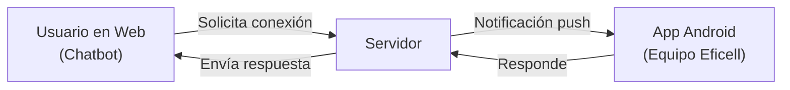

---

## Arquitectura de Navegación

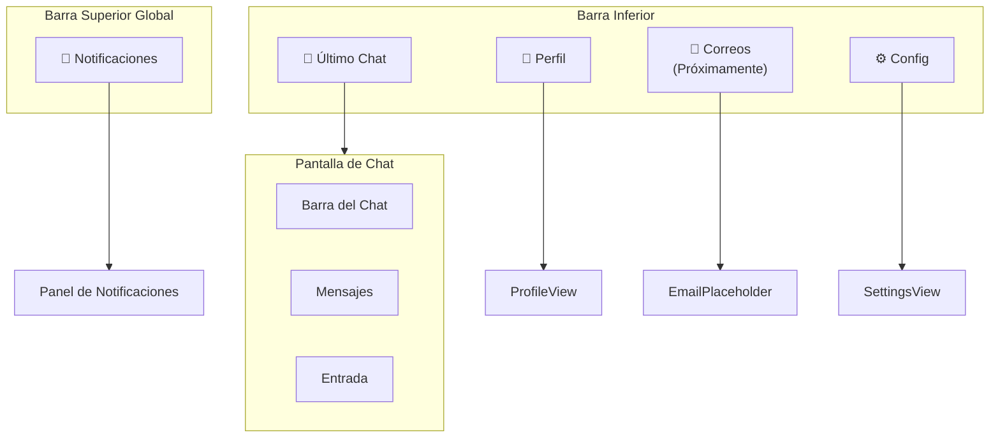

---

## 1. Panel de Notificaciones (Global)

Botón **🔔** visible en la barra superior de **toda la app** (todas las pantallas):

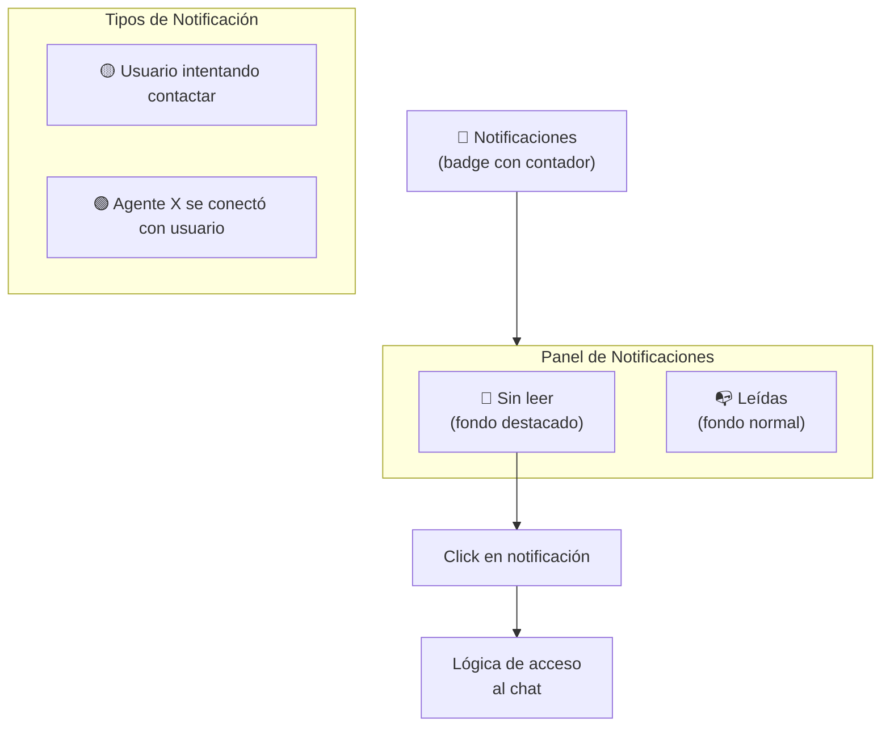

| Estado | Descripción | Visual |
|---|---|---|
| **🟡 Intentando contactar** | Usuario esperando ser atendido | Fondo destacado (sin leer), badge activo |
| **🟢 Ya contactado** | Otro agente se conectó | Notificación actualizada |
| **Leída** | Notificación ya vista | Fondo normal |

| Regla | Detalle |
|---|---|
| **Estado visual** | Sin leer = fondo destacado. Leída = fondo normal |
| **Al cerrar panel** | Todas las notificaciones pasan a "leídas" automáticamente |
| **Click** | Ejecuta la lógica de acceso al chat (funcional, no solo visual) |

### 1.1 Lógica de Acceso al Click de Notificación

Al hacer click en una notificación (dentro de la app o notificación externa push):

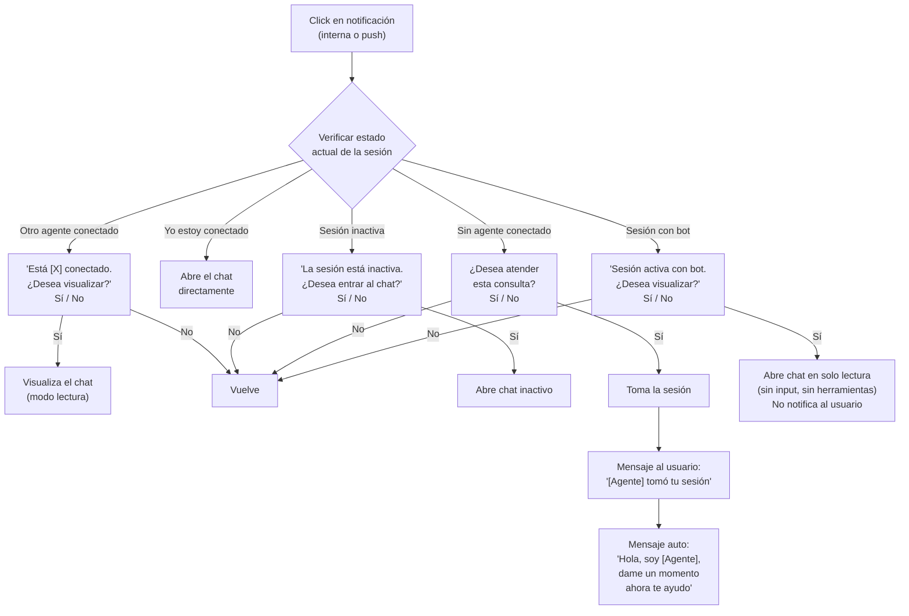

| Escenario | Diálogo | Acción al aceptar |
|---|---|---|
| **Otro agente conectado** | *"Está [X] conectado. ¿Desea visualizar?"* | Abre chat en modo lectura |
| **Yo conectado** | Ninguno | Abre chat directo |
| **Sesión inactiva** | *"La sesión está inactiva. ¿Desea entrar?"* | Abre chat inactivo |
| **Sin agente** | *"¿Desea atender esta consulta?"* | Toma sesión → mensajes automáticos al usuario |
| **Sesión con bot** | *"Sesión activa con bot. ¿Desea visualizar?"* | Abre en solo lectura, sin input ni herramientas, no notifica al usuario |

---

## 2. Chat — Funcionalidades

### 2.1 Barra Superior del Chat

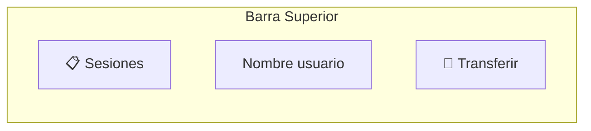

### 2.2 Menú de Adjuntos

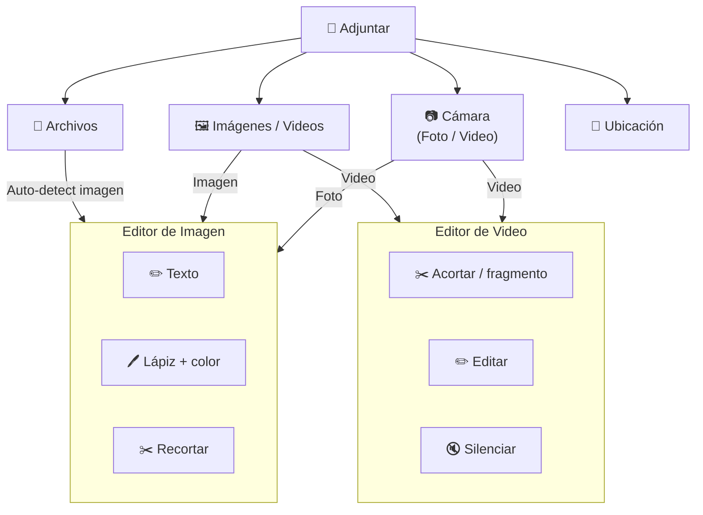

| Función | Detalle |
|---|---|
| **📷 Cámara** | Foto → editor imagen. Video → editor video (se abre automáticamente) |
| **📁 Archivos** | Cualquier tipo. Auto-detect imágenes → editor |
| **🖼️ Media** | Galería. Imágenes → editor. Videos → editor video (se abre automáticamente) |
| **📍 Ubicación** | Mapa interactivo |

#### Editor de Video — Detalle

| Regla | Detalle |
|---|---|
| **Auto-apertura** | Al adjuntar video, el editor se abre automáticamente |
| **Lista inferior** | Muestra todos los videos a enviar. Seleccionar cada uno para editar |
| **Fragmento** | Se puede acortar o alargar el fragmento seleccionado |
| **Silenciar** | Opción para silenciar el audio del video |
| **Persistencia** | Al re-editar, muestra el fragmento previamente seleccionado |

### 2.3 Grabación de Audio

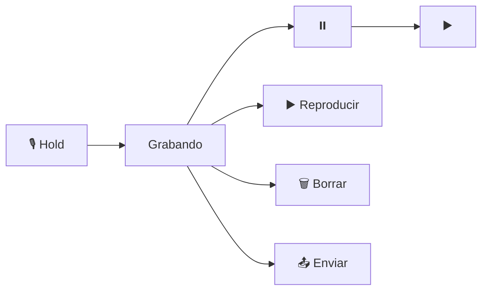

### 2.4 Previsualización de Adjuntos

| Regla | Comportamiento |
|---|---|
| **Imágenes/Videos** | Hasta 5 miniaturas |
| **Archivos** | Hasta 2 nombres truncados (7 chars + `...`) |
| **Solo media** | `(...)` al lado de imágenes |
| **Solo archivos** | `(...)` al lado de archivos |
| **Ambos** | `(...)` al lado de archivos |

#### Click en adjunto en el listado completo `(...)`

| Tipo de archivo | Al clickear |
|---|---|
| **Imagen** | Módulo con previsualización + ✏️ lápiz (abre editor imagen) + ✕ cerrar |
| **Video** | Módulo con previsualización + ✏️ lápiz (abre editor video con fragmento actual) + ✕ cerrar |
| **Otro archivo** | Módulo con nombre completo + extensión + 🗑️ eliminar + ✕ cerrar |

> Al editar un video desde aquí, abre el editor con el fragmento previamente seleccionado, permitiendo alargarlo o acortarlo.

### 2.5 Ubicación

| Control | Posición | Función |
|---|---|---|
| **🔍 Buscar** | Superior derecha | Buscar dirección |
| **⛶ Mover** | Superior izquierda | Mover mapa, pin al centro |
| **📍 GPS** | Al lado de ⛶ | Ubicación actual |
| **Enviar** | Inferior, botón | Abre módulo de confirmación |

#### Módulo de confirmación al enviar ubicación

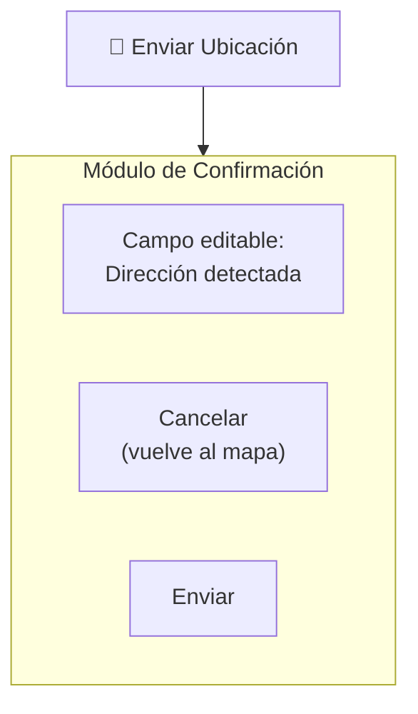

| Elemento | Función |
|---|---|
| **Campo dirección** | Texto editable con la dirección detectada, se puede cambiar |
| **Cancelar** | Cierra solo el módulo, vuelve al mapa tal como estaba |
| **Enviar** | Confirma y envía la ubicación al chat |

### 2.6 Selección y Eliminación de Mensajes

| Regla | Detalle |
|---|---|
| **Quién** | Solo equipo |
| **Selección** | Mantener presionado → seleccionar más |
| **Confirmación** | *"¿Eliminar X mensajes?"* |
| **Alcance** | Borra para todos (incluye adjuntos) |
| **Visual** | El mensaje se elimina silenciosamente del chat (no muestra *"eliminado"*) |

### 2.7 Panel de Adjuntos (al tocar nombre de usuario)

| Sección | Contenido |
|---|---|
| **📁 Archivos** | Sin imágenes, videos ni audios |
| **🖼️ Media / Audios** | Imágenes, videos y audios |
| **📍 Ubicaciones** | Ubicaciones compartidas |

| Acción | Disponibilidad |
|---|---|
| **⬇️ Descargar** | Siempre |
| **👁️ Previsualizar** | Solo doc/img/vid/audio |
| **💬 Abrir en chat** | Siempre (navega al mensaje) |

---

## 3. Gestión de Sesiones

### 3.1 Lista de Sesiones

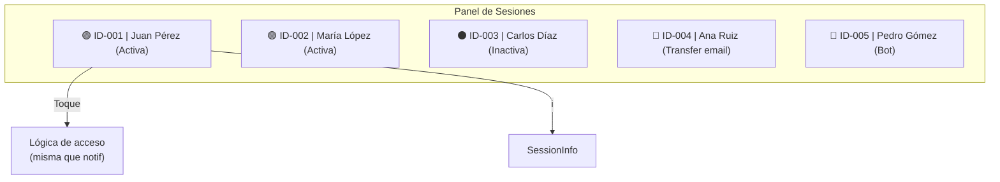

> **Nota:** Al abrir un chat aplica la **misma lógica de verificación** que las notificaciones (otro agente, yo mismo, inactiva, sin agente, **bot**).

### 3.2 Información de Sesión (ℹ️)

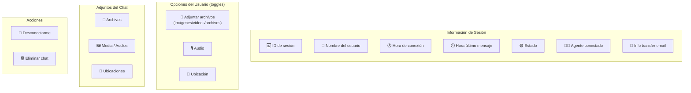

| Campo | Descripción |
|---|---|
| **ID** | Identificador único |
| **Nombre** | Usuario web |
| **Estado** | 🟢 Activa / ⚫ Inactiva / 📧 Transferida / 🤖 Bot |
| **Hora conexión** | Cuándo se conectó el usuario |
| **Último mensaje** | Hora del último mensaje |
| **Agente** | Quién atiende |
| **Transfer email** | Si aplica: asunto, correo, mensaje, agente destino |

### 3.3 Control de Opciones del Usuario

Desde la info de sesión, el agente puede **habilitar/deshabilitar** opciones individuales para el usuario web:

| Opción | Default | Efecto al habilitar |
|---|---|---|
| **📎 Adjuntar archivos** | ❌ | Usuario puede enviar archivos (imágenes, videos, cualquier archivo) |
| **🎙️ Audio** | ❌ | Usuario puede grabar y enviar audio |
| **📍 Ubicación** | ❌ | Usuario puede compartir ubicación |

#### Reglas de adjuntos del usuario

| Regla | Detalle |
|---|---|
| **Selector** | Un solo botón 📎 → selector general (imágenes, videos, archivos) |
| **Sin herramientas avanzadas** | Sin editor de imagen, video, lápiz ni recorte |
| **Eliminar adjunto** | Cada adjunto muestra ✕ → confirmación: *"¿Eliminar este adjunto?"* |
| **Compresión** | Imágenes/videos se comprimen automáticamente |

#### Reglas de audio del usuario (simplificado)

| Control | Función |
|---|---|
| **🎙️ Hold** | Mantener presionado para grabar |
| **⏸️ Pausar** | Pausa la grabación para escuchar lo grabado |
| **🗑️ Borrar** | Elimina la grabación |
| **📤 Enviar** | Envía el audio |

> Sin reanudar. El pausar es solo para escuchar. Solo puede eliminar o enviar.

> Por defecto el usuario solo envía texto. El agente habilita cada opción según la consulta.

### 3.4 Desconexión y Eliminación

| Acción | Confirmación | Resultado |
|---|---|---|
| **🔴 Desconectarme** | Módulo flotante | Sin agentes → sesión inactiva |
| **🗑️ Eliminar chat** | Módulo flotante | Chat eliminado |

---

## 4. Transferencia de Chat

### 4.1 Chat en línea

| Escenario | Acción |
|---|---|
| **→ Otro agente** | Confirma y notifica al usuario |
| **→ Yo mismo** | Vuelve al chat sin mensaje |

### 4.2 Email

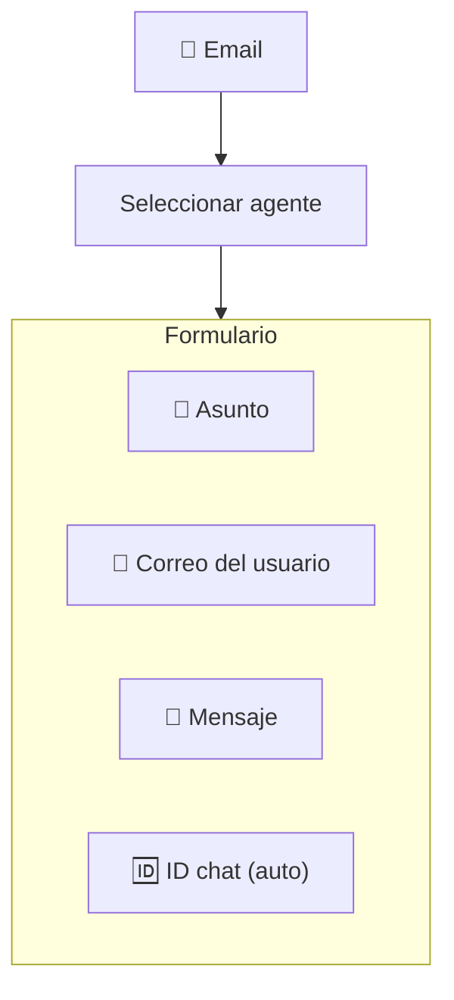

---

## 5. Barra Inferior

### 5.1 Perfil

| Función | Detalle |
|---|---|
| **Foto** | Ver / cambiar. Solo foto visible al usuario web |
| **Nombre** | Editar nombre visible |
| **Correo** | Vincular email |
| **Contraseña** | Cambiar |

### 5.2 Correos → *"Próximamente disponible"*

### 5.3 Configuración

| Opción | Tipo |
|---|---|
| Modo oscuro/claro | Toggle |
| Tamaño texto | Slider |
| GPS | Toggle |
| Micrófono | Toggle |
| Notificaciones externas | Toggle |
| Burbuja flotante | Toggle |

---

## Mapa Completo

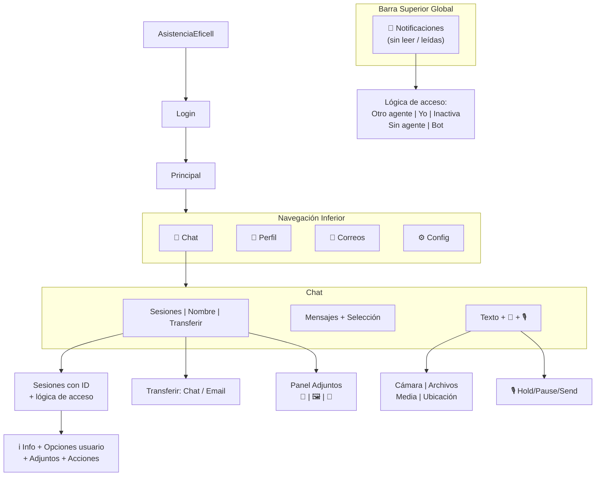

---

## Resumen

| # | Característica | Estado |
|---|---|---|
| 1 | 🔔 Panel de notificaciones global (sin leer / leídas) | 🔲 |
| 2 | Lógica de acceso al chat (otro agente, yo, inactiva, sin agente, bot) | 🔲 |
| 3 | Mensajes automáticos al tomar sesión | 🔲 |
| 4 | Notificaciones push externas con acceso directo | 🔲 |
| 5 | Chat en tiempo real | 🔲 |
| 6 | Cámara: foto + editor / video + editor | 🔲 |
| 7 | Archivos: cualquier tipo, auto-detect imágenes | 🔲 |
| 8 | Galería: imágenes + editor / videos + editor | 🔲 |
| 9 | Editor imagen: texto + lápiz + recortar | 🔲 |
| 10 | Editor video: acortar + editar + silenciar + auto-apertura | 🔲 |
| 11 | Compresión de medios | 🔲 |
| 12 | Audio: hold, pausar, reanudar, reproducir, borrar, enviar | 🔲 |
| 13 | Previsualización adjuntos (5 imgs + 2 archivos + ...) | 🔲 |
| 14 | Ubicación: mapa, buscar, GPS, mover, dirección editable | 🔲 |
| 15 | Selección múltiple + eliminación mensajes | 🔲 |
| 16 | Panel adjuntos: archivos, media/audios, ubicaciones | 🔲 |
| 17 | Sesiones con ID + lógica de acceso | 🔲 |
| 18 | Control de opciones del usuario (habilitar/deshabilitar) | 🔲 |
| 19 | Info sesión + adjuntos + transfer email info | 🔲 |
| 20 | Desconexión + eliminación de chat | 🔲 |
| 21 | Transferir chat / email con formulario | 🔲 |
| 22 | Perfil (foto visible al usuario web) | 🔲 |
| 23 | Correos (placeholder) | 🔲 |
| 24 | Configuración: tema, texto, GPS, mic, notif, burbuja | 🔲 |
