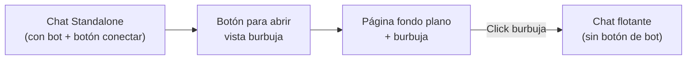
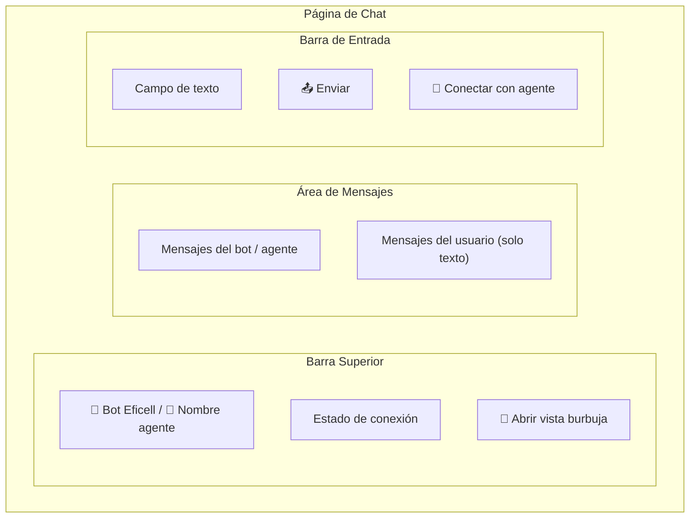
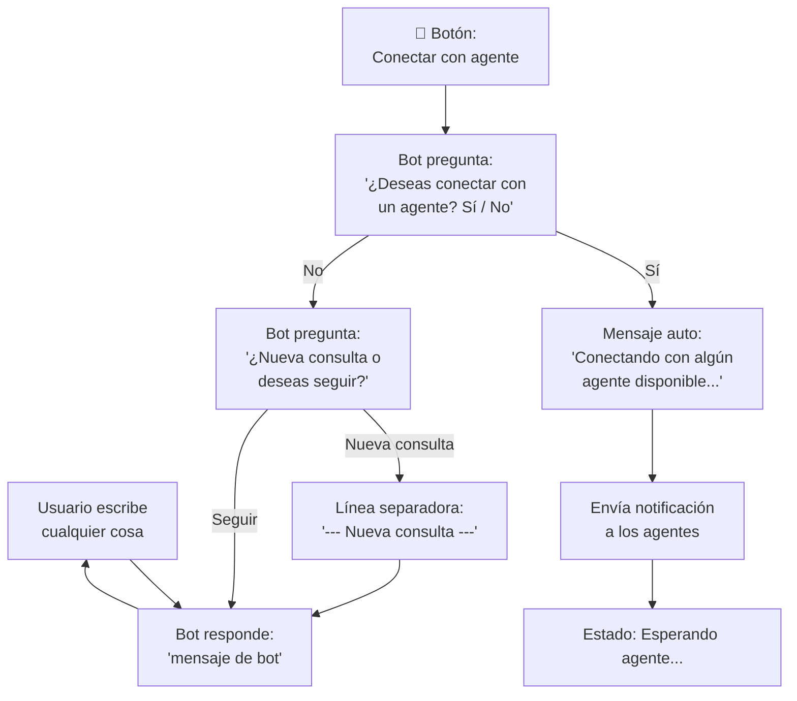
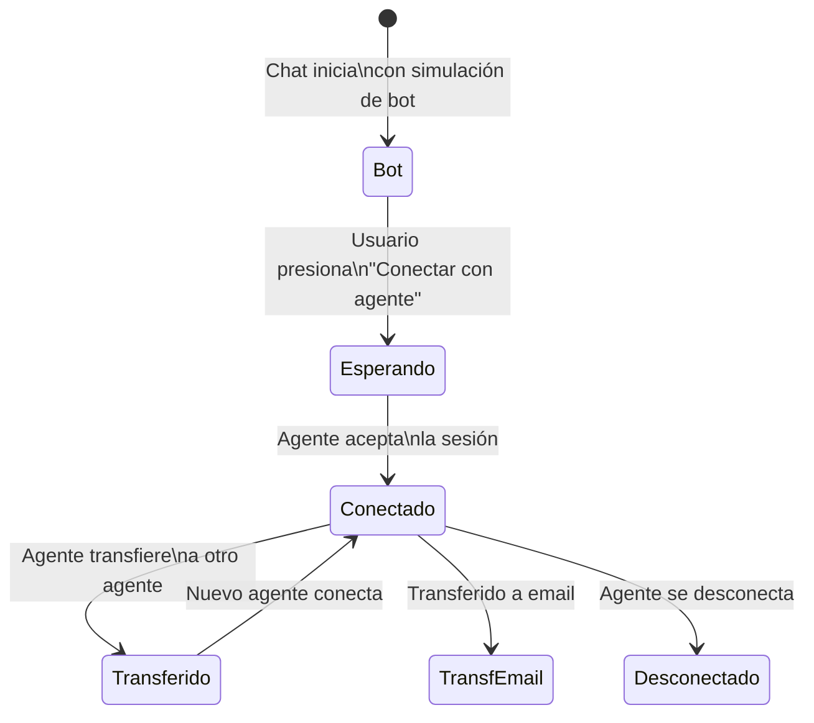
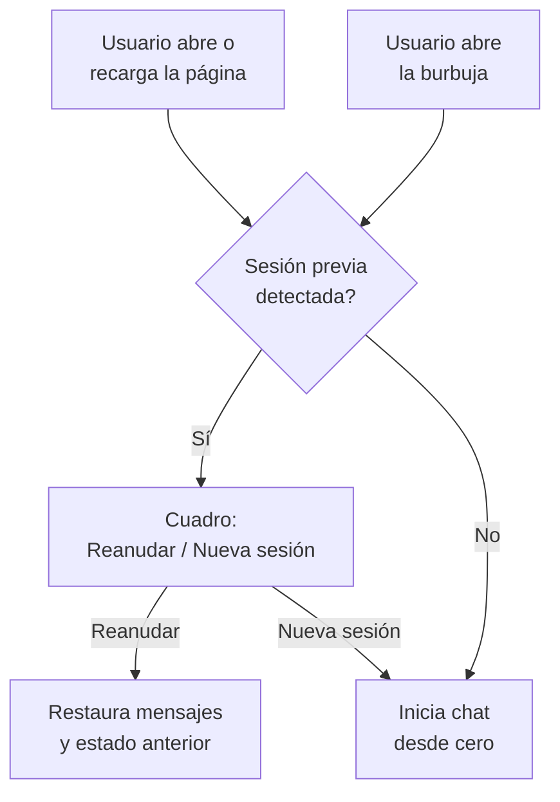
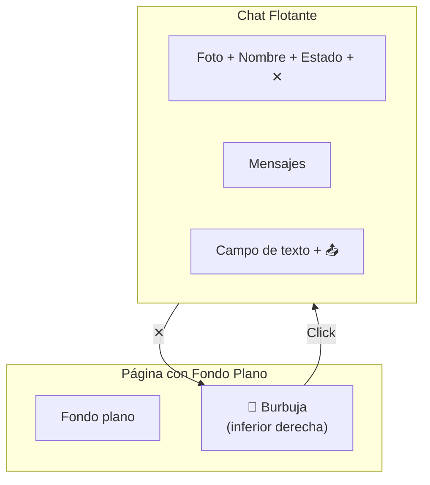
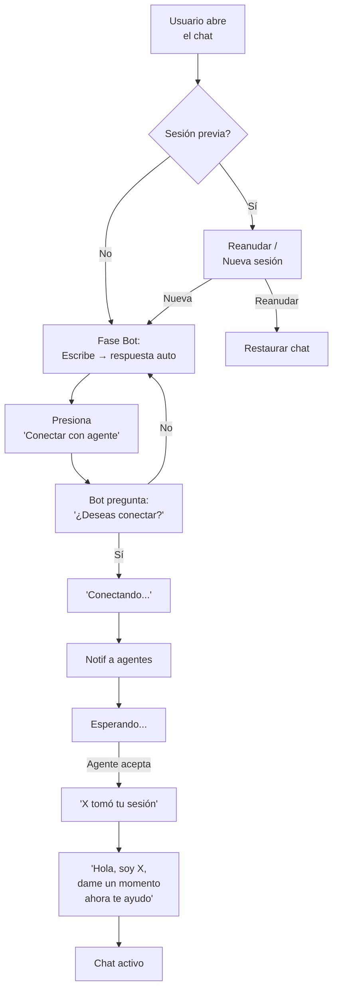

# AsistenciaEficell — Interfaz Web del Usuario (Chat)

## Visión General

Página web con el chat para que el **usuario** se comunique con el **equipo de Eficell**. Dos modos de visualización:

| Vista | Descripción |
|---|---|
| **Chat Standalone** | Página completa. Incluye simulación de bot + botón de conexión con agente |
| **Burbuja embebible** | Página con fondo plano + burbuja inferior derecha. Solo chat, sin botón de bot |



---

## 1. Vista: Chat Standalone (Página Completa)



### 1.1 Simulación del Bot

Antes de conectar con un agente, el chat funciona como simulación de bot:



| Fase | Comportamiento |
|---|---|
| **Bot activo** | Usuario escribe → respuesta automática: *"mensaje de bot"* |
| **Botón conectar** | Solo en standalone. Envía mensaje pidiendo confirmación |
| **Confirmación** | Bot pregunta *"¿Deseas conectar con un agente?"* → Sí/No |
| **Sí** | Envía mensaje auto + notifica agentes |
| **No** | Bot pregunta *"¿Nueva consulta o deseas seguir?"* |
| **Nueva consulta** | Agrega línea separadora en el chat (historial se mantiene) |
| **Seguir** | Vuelve al chat con el bot sin cambios |
| **Esperando** | Animación de espera hasta que un agente se conecte |

> **Nota:** La simulación del bot es un placeholder. El usuario podrá integrar su bot real aquí después.
> Cada sesión de chat se guarda con un **ID único**.

### 1.2 Entrada del Usuario

Por defecto el usuario **solo puede enviar texto**. El agente puede habilitar opciones adicionales individualmente desde la info de sesión.

| Elemento | Detalle |
|---|---|
| **Campo de texto** | Siempre disponible |
| **📤 Enviar** | Envía el mensaje de texto |
| **🔗 Conectar** | Solo en standalone. Pide conexión con agente |
| **📎 Archivos** | Solo si el agente lo habilita |
| **🎙️ Audio** | Solo si el agente lo habilita |
| **📍 Ubicación** | Solo si el agente lo habilita |

### 1.2.1 Adjuntos del Usuario (cuando el agente habilita 📎)

Aparece un **único botón 📎** que abre el selector de archivos. Desde ahí se seleccionan imágenes, videos o cualquier archivo.

| Regla | Detalle |
|---|---|
| **Selector** | Un solo botón 📎 → selector general (imágenes, videos, archivos) |
| **Sin herramientas avanzadas** | Sin editor de imagen/video, lápiz ni recorte |
| **Eliminar antes de enviar** | Cada adjunto muestra **✕** → confirmación: *"¿Eliminar este adjunto?"* |
| **Compresión** | Imágenes y videos se comprimen automáticamente |

### 1.2.2 Audio del Usuario (cuando el agente habilita 🎙️)

Aparece un botón **🎙️** al lado de los adjuntos. Versión simplificada:

| Control | Función |
|---|---|
| **🎙️ Hold** | Mantener presionado para grabar |
| **⏸️ Pausar** | Pausa y permite escuchar lo grabado |
| **🗑️ Borrar** | Elimina la grabación |
| **📤 Enviar** | Envía el audio |

> Sin opción de reanudar. El pausar es solo para escuchar. Solo puede eliminar o enviar.

> El agente controla cada opción individualmente desde la info de sesión (ℹ️) en la app Android.

### 1.3 Estados de Conexión



| Estado | Visual en el chat |
|---|---|
| **Bot** | Barra muestra: *"🤖 Bot Eficell"*. Respuestas automáticas |
| **Esperando** | Mensaje: *"Conectando con algún agente disponible..."* + animación |
| **Conectado** | Barra cambia a: foto + nombre agente + 🟢. Mensaje: *"[Agente] tomó tu sesión"* + auto: *"Hola, soy [Agente], dame un momento ahora te ayudo"* |
| **Transferido** | Mensaje: *"Has sido transferido a [Agente2]"* |
| **Transfer. email** | Mensaje: *"Tu consulta fue derivada por email. Recibirás respuesta en [correo]"* |
| **Desconectado** | Mensaje: *"El agente se ha desconectado"*. Estado → ⚫ |

### 1.4 Tipos de Mensajes Visibles

| Tipo | Visualización |
|---|---|
| **Texto** | Burbuja de chat |
| **Imagen** (del agente) | Miniatura expandible |
| **Video** (del agente) | Reproductor inline |
| **Audio** (del agente) | Barra de reproducción |
| **Archivo** (del agente) | Nombre + botón descargar |
| **Ubicación** (del agente) | Mapa preview + dirección. Al tocar → Maps |
| **Sistema** | Mensajes centrados (conexión, transferencia, etc.) |

> El usuario envía texto siempre. Puede enviar archivos/audio solo si el agente lo habilita (sin herramientas avanzadas). Recibe todo tipo de contenido del agente.

---

## 2. Persistencia de Sesión

La sesión del usuario persiste entre recargas y entre ambas vistas (standalone y burbuja).



| Regla | Detalle |
|---|---|
| **Identificación** | Cookies del navegador + IP pública como respaldo |
| **Al recargar página** | Aparece cuadro: *"Reanudar / Iniciar nueva sesión"* |
| **Al abrir burbuja** | Mismo cuadro si hay sesión previa |
| **Compartida** | La sesión persiste entre standalone y burbuja |
| **Reanudar** | Restaura historial de mensajes y estado de conexión |
| **Nueva sesión** | Inicia chat limpio desde el bot |

---

## 2. Vista: Burbuja Embebible



| Diferencia con standalone | Detalle |
|---|---|
| **Sin botón de bot** | No tiene el botón "🔗 Conectar con agente" |
| **Solo chat** | Espacio preparado para integrar el bot existente |
| **Misma funcionalidad** | Una vez conectado, funciona igual al standalone |

### 2.1 Burbuja

| Propiedad | Detalle |
|---|---|
| **Posición** | Inferior derecha, fija |
| **Badge** | Cantidad de mensajes no leídos |
| **Animación** | Pulso suave con mensajes nuevos |
| **Apertura** | Expansión suave desde la burbuja |
| **Cierre** | Contracción hacia la burbuja (no pierde el chat) |
| **Sesión** | Al abrir, muestra *"Reanudar / Nueva sesión"* si hay sesión previa |

---

## 4. Flujo Completo



---

## 5. Estructura de Archivos

```
AsistenciaEficell/
├── index.html          ← Chat standalone (bot + conectar)
├── bubble.html         ← Fondo plano + burbuja
├── css/
│   ├── chat.css
│   ├── bubble.css
│   └── themes.css
├── js/
│   ├── chat.js         ← Lógica del chat
│   ├── bot.js          ← Simulación del bot
│   ├── bubble.js       ← Lógica de la burbuja
│   ├── session.js      ← Persistencia de sesión
│   └── websocket.js    ← Conexión en tiempo real
└── assets/
    └── icons/
```

---

## Resumen

| # | Característica | Estado |
|---|---|---|
| 1 | Chat standalone con simulación de bot | 🔲 |
| 2 | Respuesta auto del bot: *"mensaje de bot"* | 🔲 |
| 3 | Botón conectar con confirmación (solo standalone) | 🔲 |
| 4 | Persistencia de sesión (cookies + IP) | 🔲 |
| 5 | Cuadro reanudar / nueva sesión (en recarga y burbuja) | 🔲 |
| 6 | Vista burbuja embebible | 🔲 |
| 7 | Chat flotante desde burbuja | 🔲 |
| 8 | Usuario solo envía texto (por defecto) | 🔲 |
| 9 | Opciones adicionales controladas por agente | 🔲 |
| 10 | Estados: bot, esperando, conectado, transferido, email, desconectado | 🔲 |
| 11 | Mensajes auto al conectar agente | 🔲 |
| 12 | Visualización de todos los tipos de contenido del agente | 🔲 |
| 13 | Mensajes eliminados visibles como eliminados | 🔲 |
| 14 | Badge + animaciones en burbuja | 🔲 |
